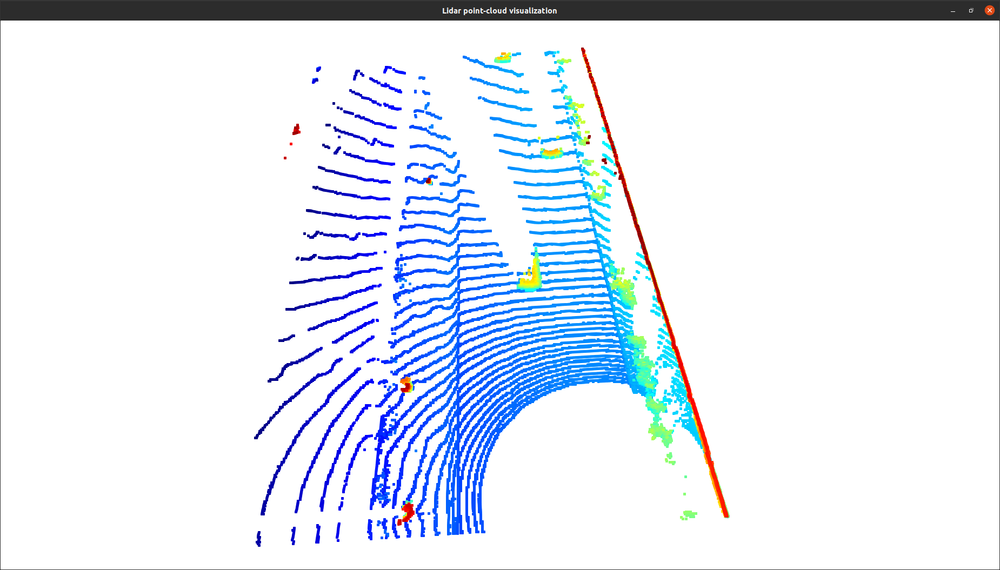

# Midterm: 3D Object Detection

## Compute Lidar Point-Cloud from Range Image

### Visualize range image channels (ID_S1_EX1)

* Convert range image “range” channel to 8bit

```python
ri_range = ri_range * 255 / (np.amax(ri_range) - np.amin(ri_range))
```

* Convert range image “intensity” channel to 8bit

```python
percentile_1, percentile_99 = percentile(ri_intensity,1), percentile(ri_intensity,99)
ri_intensity = 255 * np.clip(ri_intensity,percentile_1,percentile_99)/percentile_99 
```

* Crop range image to +/- 90 deg. left and right of the forward-facing x-axis

```python
deg90 = int(img_range_intensity.shape[1] / 4)
ri_center = int(img_range_intensity.shape[1]/2)
img_range_intensity = img_range_intensity[:,ri_center-deg90:ri_center+deg90]
```

* Stack cropped range and intensity image vertically and visualize the result using OpenCV

```python
img_range = ri_range.astype(np.uint8)
img_intensity = ri_intensity.astype(np.uint8)
img_range_intensity = np.vstack((img_range, img_intensity))
```

* output


### Visualize point-cloud (ID_S1_EX2)

* Visualize the point-cloud using the open3d module


* Find 10 examples of vehicles with varying degrees of visibility in the point-cloud

* Try to identify vehicle features that appear stable in most of the inspected examples and describe them

## Create Birds-Eye View from Lidar PCL

### Convert sensor coordinates to bev-map coordinates (ID_S2_EX1)

* Convert coordinates in x,y [m] into x,y [pixel] based on width and height of the bev map

```python
bev_discret = (configs.lim_x[1] - configs.lim_x[0]) / configs.bev_height
lidar_pcl_cpy[:, 0] = np.int_(np.floor(lidar_pcl_cpy[:, 0] / bev_discret))
lidar_pcl_cpy[:, 1] = np.int_(np.floor(lidar_pcl_cpy[:, 1] / bev_discret) + (configs.bev_width + 1) / 2)
```

* output


### Compute intensity layer of bev-map (ID_S2_EX2)

* Assign lidar intensity values to the cells of the bird-eye view map

```python
_, idx_height_unique, counts = np.unique(lidar_pcl_cpy[:, 0:2], axis=0, return_index=True, return_counts=True)
lidar_pcl_top = lidar_pcl_cpy[idx_height_unique]
```

* Adjust the intensity in such a way that objects of interest (e.g. vehicles) are clearly visible

```python
percentile1 = np.percentile(lidar_pcl_top[:, 3], 1)
percentile99 = np.percentile(lidar_pcl_top[:, 3], 99)
intensity_map[np.int_(lidar_pcl_top[:, 0]), np.int_(lidar_pcl_top[:, 1])] = (np.clip(lidar_pcl_top[:, 3], percentile1, percentile99) - percentile1) / (percentile99 - percentile1)
```

* output


# Writeup: Track 3D-Objects Over Time

Please use this starter template to answer the following questions:

### 1. Write a short recap of the four tracking steps and what you implemented there (filter, track management, association, camera fusion). Which results did you achieve? Which part of the project was most difficult for you to complete, and why?


### 2. Do you see any benefits in camera-lidar fusion compared to lidar-only tracking (in theory and in your concrete results)? 


### 3. Which challenges will a sensor fusion system face in real-life scenarios? Did you see any of these challenges in the project?


### 4. Can you think of ways to improve your tracking results in the future?

